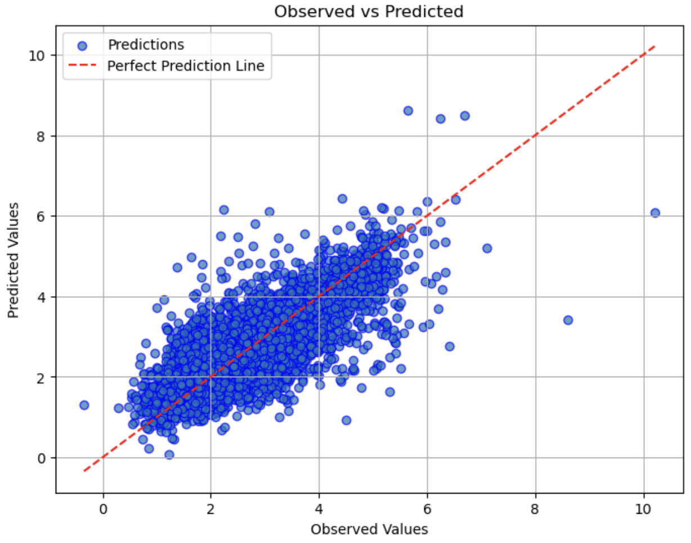
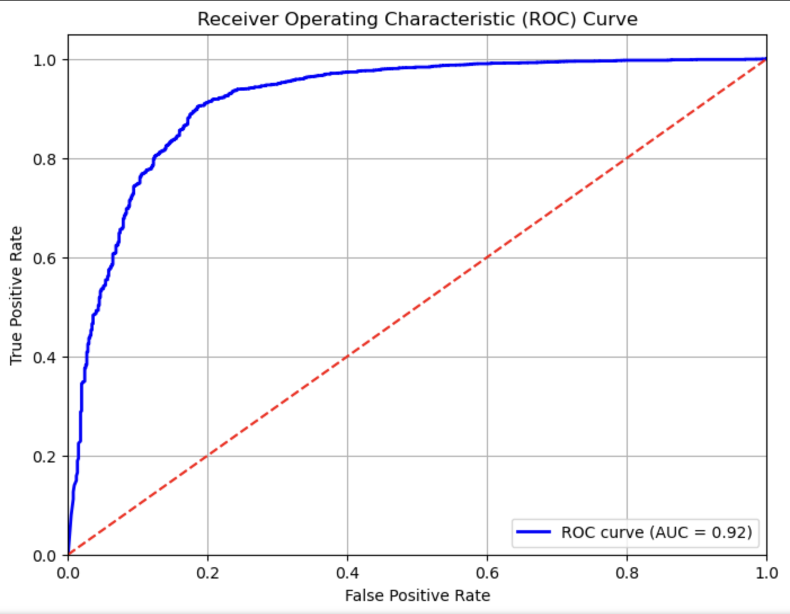

# Toxicity

Toxicity measures how much damage a drug could cause to organisms.

## Table of Contents

- [LD50](#ld50)
- [Data comparison](#data-comparison)

## LD50

Acute toxicity LD50 measures the most conservative dose that can lead to lethal adverse effects. The higher the dose, the more lethal of a drug.

| Name | Size | MAE | RMSE | R2 | Spearman | Link |  
|------|------|-----|------|----|----------|------|  
| LD50 | 7282 | 0.437 | 0.609 | 0.596 | 0.745 | [Download ZIP](https://datagrok-github-lfs.s3.us-east-2.amazonaws.com/toxicity/ld50.zip) |

Let me know if you need any more adjustments!

### Observed vs. Predicted plot

## hERG

Inhibition of the hERG (human Ether-à-go-go-Related Gene) current causes QT interval prolongation and lead to life threatening arrhythmia. Inhibition of hERG is considered as precaution.

| Name | Size | Specificity | Sensitivity | Accuracy | Balanced Accuracy | Link |  
|------|------|-------------|-------------|----------|-------------------|------|  
| hERG | 22,249 | 0.811 | 0.897 | 0.885 | 0.854 | [Download ZIP](https://datagrok-github-lfs.s3.us-east-2.amazonaws.com/toxicity/herg.zip) |

## Data comparison

| Name | Size | Processed size | TDC size | TDC processed size | Common | Resulting |
|-|-|-|-|-|-|-|
| hERG | 22263 | 22248 | - | - | - | 22248 |
| H-HT | 2171 | 2170 | - | - | - | 2170 |
| Ames | 8085 | 7742 | - | - | - | 7742 |
| SkinSen | 739 | 549 | - | - | - | 549 |
| LD50 | 7385 | 7282 | - | - | - | 7282 |
