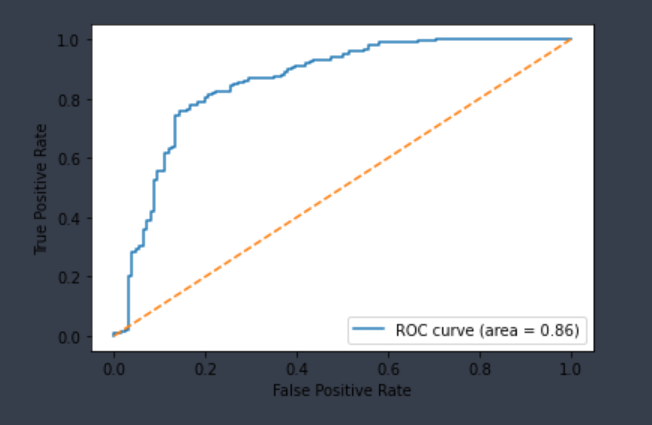

# Absorption

Absorption is the process by which drugs enter the bloodstream after administration. It is pivotal in pharmaceutical research, enabling enhanced bioavailability, precise dosing, formulation optimization, reduced variability among patient populations, and minimized side effects. In this part, we studied 3 absorption-related endpoints.

## Pgp-Inhibitor

It is a probability of being an inhibitor of P-glycoprotein which is responsible for cell membrane transport. Inhibiting Pgp leads to low cell permeability of substance.

The Pgp-Inhibitor dataset combines data from two sources, comprising 1,275 compounds, with 666 classified as inhibitors and 609 as non-inhibitors.

Results on dataset (higher is better).

| Dataset | Size | Specificity | Sensitivity | Accuracy |
| :---: | :---: | :---: | :---: | :---: |
| Pgp-Inhibitor | 1,275 | 0.8771 | 0.9269 |  0.9038 |

## Pgp-Substrate

It is a probability of being a substrate of P-glycoprotein which is responsible for cell membrane permeability. Compounds with high molecular mass and a large number of polar atoms are the most probable substrates. Binding the substrate leads to low cell permeability of substance.

The Pgp-Substrate dataset is derived from a single source, encompassing 332 compounds, of which 126 are substrates, and 206 are non-substrates.

Results on dataset (higher is better).

| Dataset | Size | Specificity | Sensitivity | Accuracy |
| :---: | :---: | :---: | :---: | :---: |
| Pgp-Substrate | 332 | 0.7857 | 0.8203 |  0.8072 |

## F

The range of bioavailability value is 0-100. One threshold (30%) was applied in order to split compounds into posititve and negative. A probability that less than 30% of substance reaches systemic circulation.

Overall, the dataset contains 986 compounds, where positive category contains 660 compounds and negative 326.
