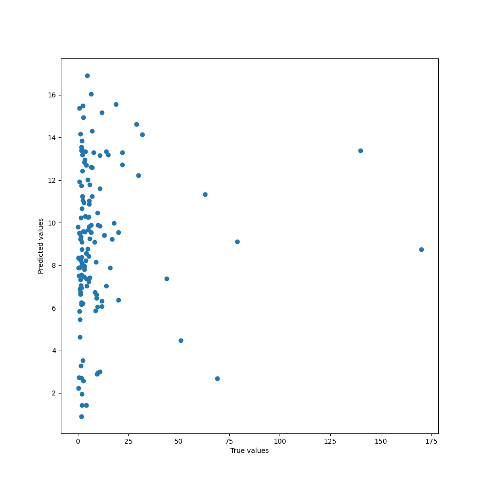
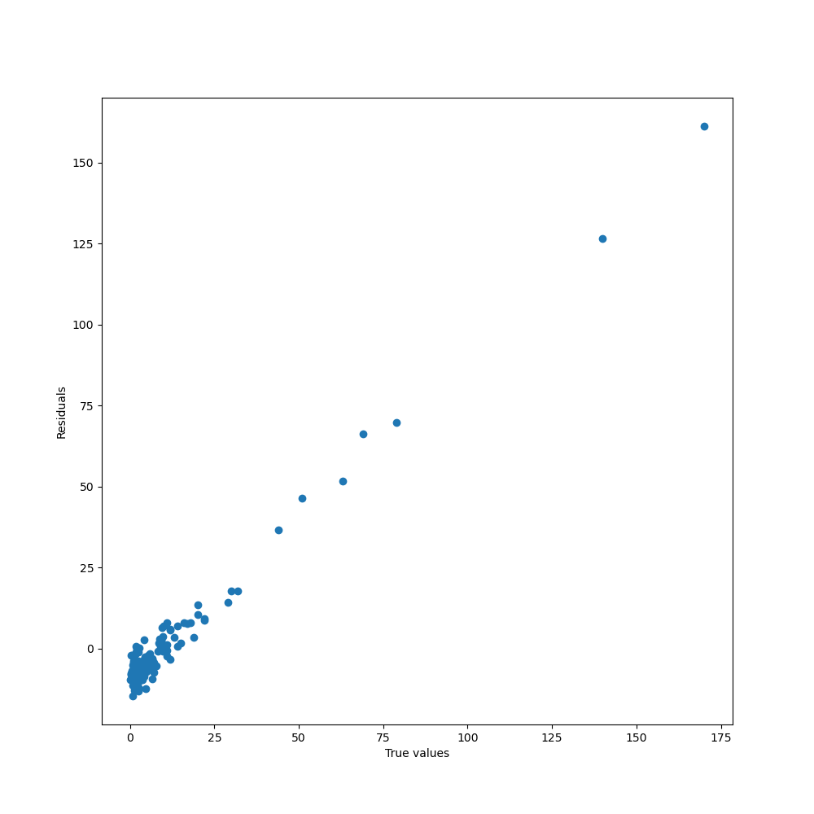
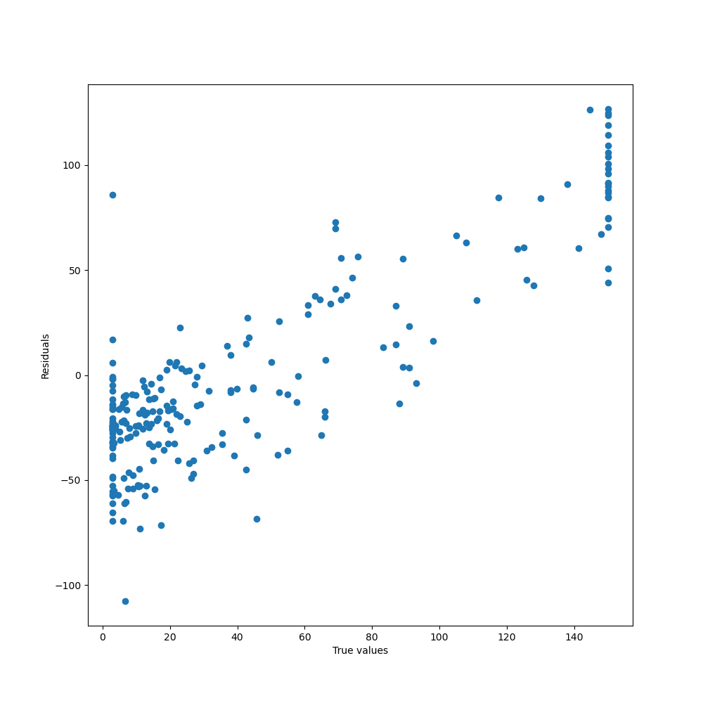
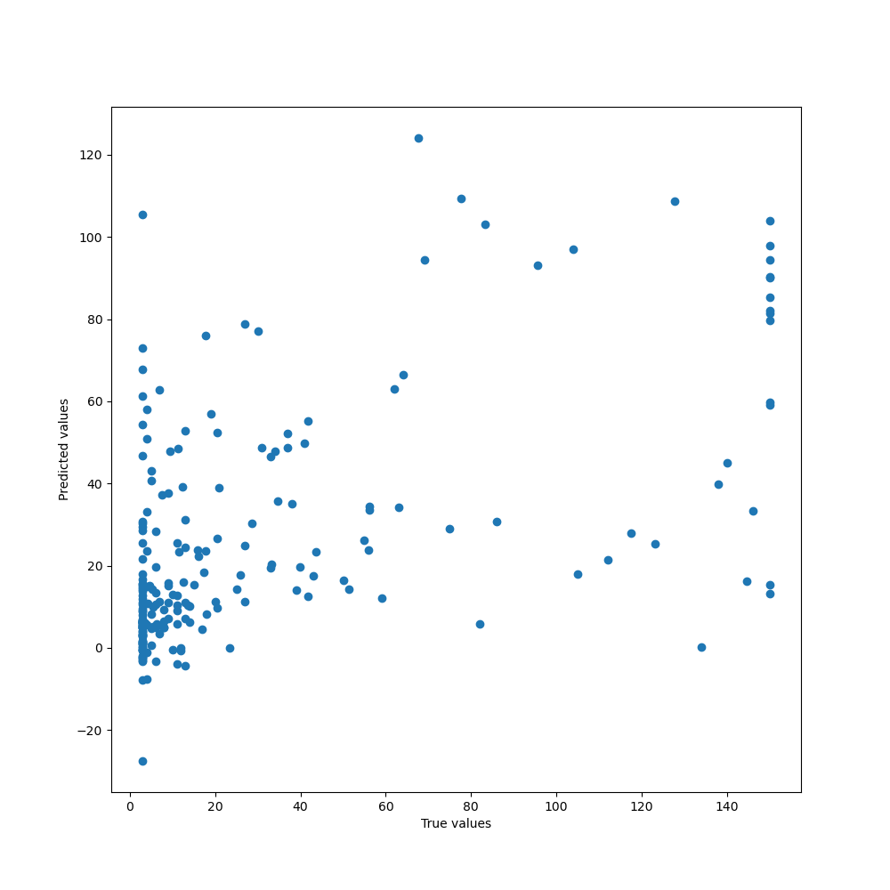
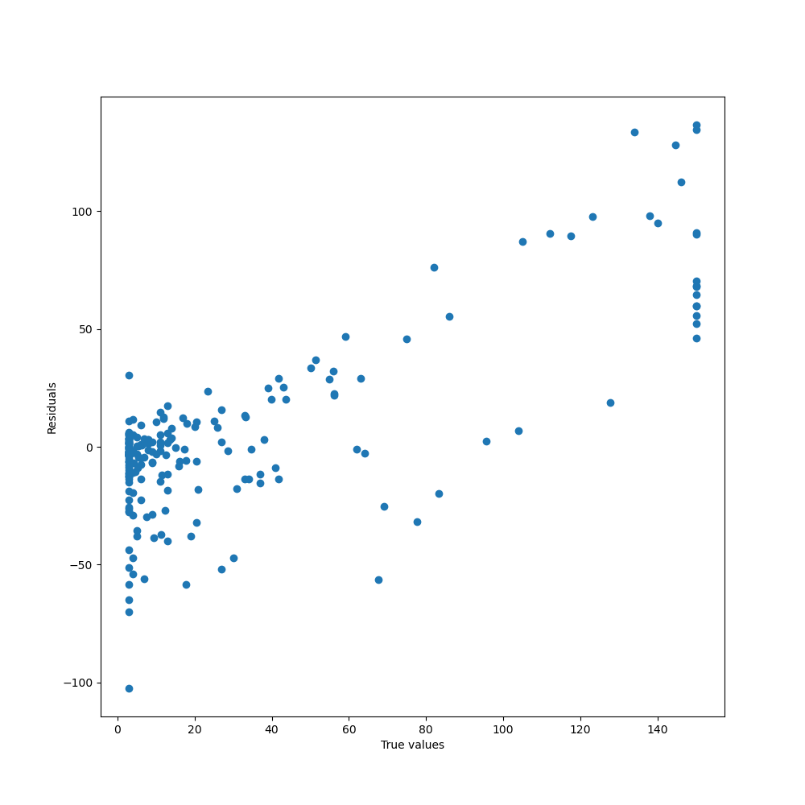

# Excretion

Drug excretion is the removal of drugs from the body using various different routes of excretion, including urine, bile, sweat, saliva, tears, milk, and stool.

## Table of Contents

- [Half Life](#half-life)
- [Clearance](#clearance)
- [Data comparison](#data-comparison)

## Half Life

Half life of a drug is the duration for the concentration of the drug in the body to be reduced by half. It measures the duration of actions of a drug.

| Name | Size | MAE | RMSE | R2 | Spearman |
|-|-|-|-|-|-|
| Half Life | 667 | 9.947 | 21.780 | -0.007 | 0.208 |

### True vs. Predicted plot

### True vs. Residuals plot

## Clearance

Drug clearance is defined as the volume of plasma cleared of a drug over a specified time period and it measures the rate at which the active drug is removed from the body.

| Name | Size | MAE | RMSE | R2 | Spearman |
|-|-|-|-|-|-|
| Clearance Hepatocyte | 1213 | 35.930 | 45.848 | 0.088 | 0.379 |
| Clearance Microsome | 1102 | 21.797 | 35.914 | 0.305 | 0.573 |

### Hepatocyte

#### True vs. Predicted plot

#### True vs. Residuals plot

### Microsome

#### True vs. Predicted plot

#### True vs. Residuals plot

## Data comparison

Name | Size | Processed size | TDC size | TDC processed size | Common | Resulting |
|-|-|-|-|-|-|-|
| Half Life | 667 | 666 | 667 |666 | 666 | 667 |
| Clearance-Microsome | 1102 | 1098 | 1102 | 1098 | 1098 | 1098 |
